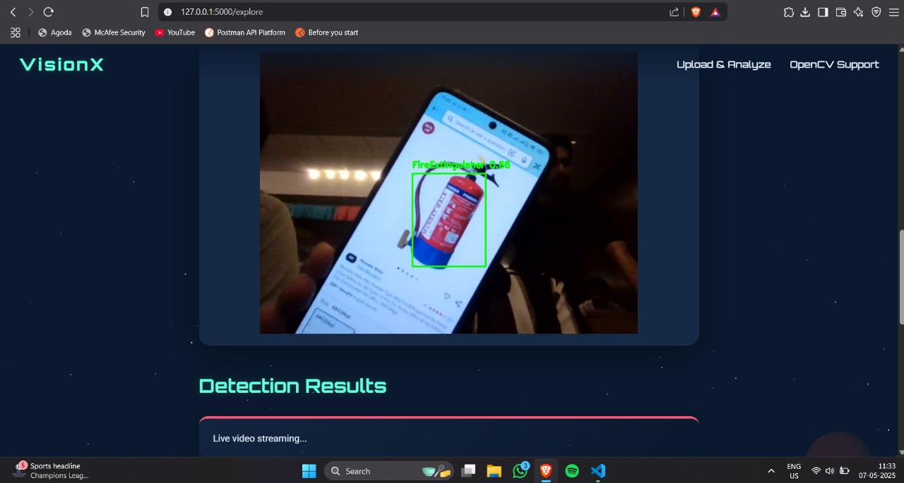
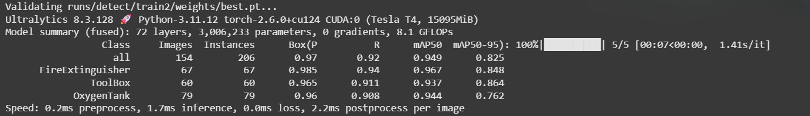

# 🔥 Real-Time Object Detection with YOLOv8 & OpenCV  
**Detect Fire Extinguishers, Toolboxes, and Oxygen Tanks in Space Stattions**  

[](https://www.python.org/downloads/)  
[](LICENSE)  
[](https://github.com/ultralytics/ultralytics)  
[](https://opencv.org/)

---

## 🎥 Live Demo  Link
▶️ [YouTube Live Inference Video](https://youtu.be/YIJmG0985mc)  
📂 [Demo)](https://drive.google.com/file/d/1rEJLyOR0bcBAR9EdYqOND9v9tzY8BO5y/view?usp=sharing)  
📘 [Full Documentation & Reports](https://visionxdocumentation.netlify.app/)

---

## 📸 Sample Output  


---

## 📸 Model Score


---

## 🚀 Overview  
This project showcases a real-time object detection system built using **YOLOv8** and **OpenCV**, tailored to recognize critical safety equipment in industrial settings:

- 🔥 Fire Extinguishers  
- 🧰 Toolboxes  
- 🧪 Oxygen Tanks  

The solution includes support for:
- Static image inference  
- Live webcam detection  
- Training from scratch on a custom dataset  
- GPU acceleration and memory optimization

---

## 📁 Project Structure
```bash
.
├── train.py                # Training script with custom params
├── predict.py          # Real-time webcam detection (optional)
├── VisionX_Model.ipynb       # Google Collab Notebook
├── yolo_params.yaml        # Configuration file (paths, classes, params)
├── data/
│   ├── train/
│   ├── val/
│   └── test/
├── runs/                   # YOLOv8 training results
```

## ✨ Features  
- 🧠 YOLOv8-based custom model trained on safety equipment  
- ⚡ GPU-enabled real-time inference  
- 🎥 Live webcam stream object detection  
- 🖼️ Static image testing with bounding box export  
- 📉 Evaluation metrics (mAP, confusion matrix, failure cases)  
- 🧼 GPU memory auto-clear and OOM error handling  
- 📥 Organized outputs and predictions  


## ⚙️ Installation & Setup

### 1. Clone the Repository
```bash
git clone https://github.com/nakul-verma2/visionx


## 2. Install dependencies:
```bash
pip install -r requirements.txt
pip install ultralytics opencv-python pyyaml torch  [Manual]
```

## 🏋️‍♂️ Training
Update yolo_params.yaml with your custom dataset paths and classes:

```yaml
train: data/train/images
val: data/val/images
test: data/test
nc: 3
names: ['FireExtinguisher', 'ToolBox', 'OxygenTank']
```
Then run:

```bash
python app.py
```
You can modify hyperparameters like epochs, learning rate, batch size directly in the script or via CLI args.


## 📊 Evaluation
Validation metrics are generated after inference using the model's .val() method on your test set.

## 📝 Reporting
A detailed report is included with:
Training methodology
Challenges and mitigation
Model improvements
Failure case analysis

📄 Full report available in Reports/ directory.

## 📌 Notes
Previous training results are stored in separate runs/detect/train* folders. You can delete old ones if storage is a concern.

Use GPU where available for best performance (device=0 is used by default).

AMP (mixed precision) is enabled by default for faster training.

## 💬 License
This project is licensed under the MIT License. Feel free to use and modify it for personal or commercial projects.


